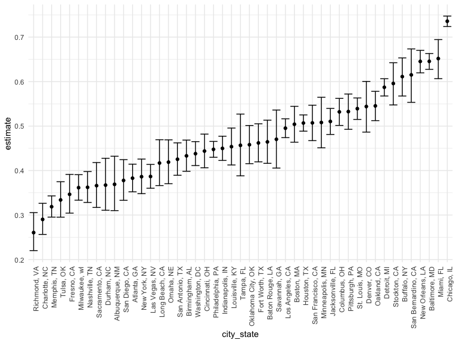
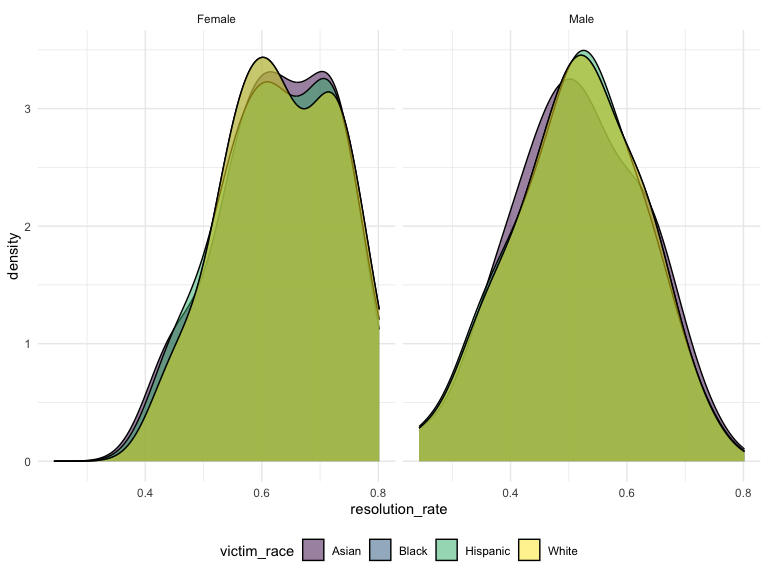
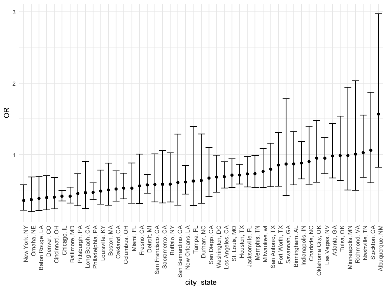
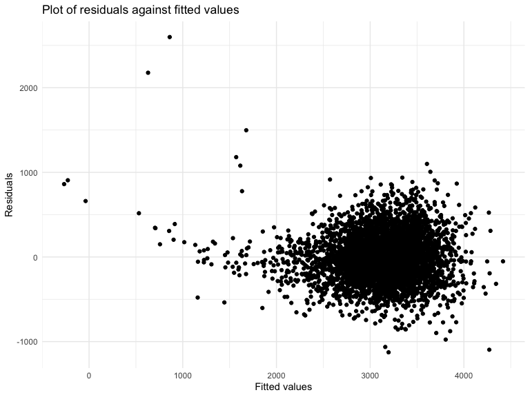
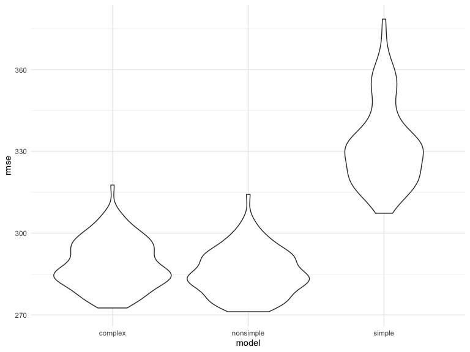

Code Example from HW
================
Anna Ma

### Problem 1: Homocide Resolution

For this problem, we are interested in data gathered and made public by
*The Washington Post* on homicides in 50 large U.S. cities.

**Data Cleaning**

For data cleaning:

1.  Created a `city_state` variable that combines city with state. This
    differentiates those cities that have the same name but are actually
    in different states.
2.  Changed `victim_age` to numeric
3.  To simplify, filtered out race that is labeled as “Other”.
4.  Created a `resolution` variable, indicating whether the homicide is
    solved.
5.  Filtered out the cities that did not report victim race:Dallas, TX;
    Phoenix, AZ; and Kansas City, MO. Also filtered out Tulsa, AL
    becuase this city does not exist and it is a wrong entry.
6.  Selected variables `city_state`, `resolution`, `victim_age`,
    `victim_sex`, and `victim_race`.

``` r
homicide_df = 
  read_csv("data/homicide-data.csv", na = c("", "NA", "Unknown")) %>% 
  mutate(
    city_state = str_c(city, state, sep = ", "),
    victim_age = as.numeric(victim_age),
    resolution = case_when(
      disposition == "Closed without arrest" ~ 0,
      disposition == "Open/No arrest"        ~ 0,
      disposition == "Closed by arrest"      ~ 1)
  ) %>% 
  filter(!(victim_race == "Other")) %>% 
  filter(!(city_state %in% c("Tulsa, AL", "Dallas, TX", "Phoenix, AZ", "Kansas City, MO"))) %>% 
  select(victim_race, victim_sex,victim_age, city_state,disposition,resolution)

homicide_df %>% head(5)%>% knitr::kable(digits = 3)
```

| victim_race | victim_sex | victim_age | city_state      | disposition           | resolution |
|:------------|:-----------|-----------:|:----------------|:----------------------|-----------:|
| Hispanic    | Male       |         78 | Albuquerque, NM | Closed without arrest |          0 |
| Hispanic    | Male       |         17 | Albuquerque, NM | Closed by arrest      |          1 |
| White       | Female     |         15 | Albuquerque, NM | Closed without arrest |          0 |
| Hispanic    | Male       |         32 | Albuquerque, NM | Closed by arrest      |          1 |
| White       | Female     |         72 | Albuquerque, NM | Closed without arrest |          0 |

The resulting data frame has 47279 entries, on variables that include
the victim name, race, age, and sex; the date the homicide was reported;
and the location of the homicide.

**Overall analysis for proportions of Unsolved Homicide estimates and
CIs**

In the next code chunk, I’ll group within cities and summarize to
produce the total number of homicides and the number that are solved.

``` r
city_homicide_df = 
  homicide_df %>% 
  select(city_state, disposition,resolution) %>% 
  group_by(city_state) %>% 
  summarize(hom_total = n(),
            hom_unsolved = sum(resolution == 0))

city_homicide_df %>% head(5)%>% knitr::kable(digits = 3)
```

| city_state      | hom_total | hom_unsolved |
|:----------------|----------:|-------------:|
| Albuquerque, NM |       252 |           93 |
| Atlanta, GA     |       969 |          371 |
| Baltimore, MD   |      2821 |         1821 |
| Baton Rouge, LA |       422 |          196 |
| Birmingham, AL  |       792 |          343 |

Next, I’ll use the `prop.test`, and functions in the `broom::tidy` and
`purrr` package to obtain estimates and CIs for the proportion of
unsolved homicides in each city in my dataset. The table below shows
those values.

``` r
test_results = 
  city_homicide_df %>% 
  mutate(prop_tests = map2(.x = hom_unsolved, .y = hom_total, ~prop.test(x = .x, n = .y)),
         tidy_tests = map(prop_tests, broom::tidy)) %>% 
  select(-prop_tests) %>% 
  unnest(cols = c(tidy_tests)) %>% 
  select(city_state, estimate, conf.low, conf.high) %>% 
  mutate(city_state = fct_reorder(city_state, estimate))

test_results %>% head(5) %>% knitr::kable(digits = 3)
```

| city_state      | estimate | conf.low | conf.high |
|:----------------|---------:|---------:|----------:|
| Albuquerque, NM |    0.369 |    0.310 |     0.432 |
| Atlanta, GA     |    0.383 |    0.352 |     0.414 |
| Baltimore, MD   |    0.646 |    0.627 |     0.663 |
| Baton Rouge, LA |    0.464 |    0.416 |     0.513 |
| Birmingham, AL  |    0.433 |    0.398 |     0.468 |

Finally, I’ll make a plot showing the estimate (and CI) of the
proportion of unsolved homicides in each city.

``` r
test_results %>% 
  mutate(city_state = fct_reorder(city_state, estimate)) %>% 
  ggplot(aes(x = city_state, y = estimate)) + 
  geom_point() + 
  geom_errorbar(aes(ymin = conf.low, ymax = conf.high)) + 
  theme(axis.text.x = element_text(angle = 90, hjust = 1))
```



This figure suggests a very wide range in the rate at which homicides
are solved – Chicago is noticeably high and, given the narrowness of the
CI, likely to have many homicides.

**Initial Analysis for Model with Visualization**

For this section, I want to visualize the resolution rate by victim race
and sex to see if the resolution rate is potentially associated with the
race or sex of the victim. Specifically, I’ll plot the density of
resolution rate by victim race in the same plot controlling for victim
sex, and create a facet to compare the victim sex plot side by side.

``` r
homicide_df %>% 
  group_by(city_state, victim_sex) %>% 
  mutate(resolution_rate = sum(resolution == 1)/n()) %>% 
  distinct(city_state,victim_sex,resolution_rate, victim_race) %>% 
  filter(victim_sex != "NA") %>% 
  ggplot(aes(x = resolution_rate, fill = victim_race)) +
  geom_density(alpha = .5) + 
  facet_grid(. ~ victim_sex) +
  theme(legend.position = "bottom")
```



From the plots, we can see from the plots that when controlling for sex,
the resolution for each victim race does not differ from each other too
much. It also shows that the distribution of resolution rate based on
victim sex is different. Therefore, it might worth to do additional
analysis on the resolution rate comparing male victims to female
victims.

**Logistic Regression**

For the model, my primary goal is to examine whether the resolution
status for homicide is different based on the victim’s sex.

In this section, I’m fitting a logistic regression model for each of the
cities, using `resolved` as the outcome and `victim_age`, `victim_sex`,
and `victim_race` as predictors. I’ll extract the adjusted odds ratio
and CIs for solving homicides comparing male victims to female victims.

``` r
model_results = 
  homicide_df %>% 
  nest(data = -city_state) %>% 
  mutate(
    models = map(data, ~glm(resolution ~ victim_age + victim_sex + victim_race, 
                            family = binomial(), data = .x)),
         tidy_models = map(models, broom::tidy)) %>% 
  select(-models, -data) %>% 
  unnest(cols = tidy_models) %>% 
  mutate(OR = exp(estimate), 
         OR_CI_upper = exp(estimate + 1.96 * std.error),
         OR_CI_lower = exp(estimate - 1.96 * std.error)) %>% 
  filter(term == "victim_sexMale") %>% 
  select(city_state, OR, OR_CI_lower, OR_CI_upper)

model_results %>%
  knitr::kable(digits = 3)
```

| city_state         |    OR | OR_CI_lower | OR_CI_upper |
|:-------------------|------:|------------:|------------:|
| Albuquerque, NM    | 1.564 |       0.823 |       2.973 |
| Atlanta, GA        | 0.981 |       0.671 |       1.433 |
| Baltimore, MD      | 0.415 |       0.318 |       0.542 |
| Baton Rouge, LA    | 0.384 |       0.213 |       0.689 |
| Birmingham, AL     | 0.869 |       0.574 |       1.317 |
| Boston, MA         | 0.503 |       0.287 |       0.881 |
| Buffalo, NY        | 0.584 |       0.333 |       1.026 |
| Charlotte, NC      | 0.902 |       0.584 |       1.393 |
| Chicago, IL        | 0.415 |       0.347 |       0.496 |
| Cincinnati, OH     | 0.400 |       0.236 |       0.677 |
| Columbus, OH       | 0.527 |       0.377 |       0.739 |
| Denver, CO         | 0.395 |       0.222 |       0.704 |
| Detroit, MI        | 0.574 |       0.456 |       0.721 |
| Durham, NC         | 0.636 |       0.315 |       1.284 |
| Fort Worth, TX     | 0.852 |       0.555 |       1.307 |
| Fresno, CA         | 0.561 |       0.312 |       1.008 |
| Houston, TX        | 0.712 |       0.586 |       0.864 |
| Indianapolis, IN   | 0.881 |       0.658 |       1.179 |
| Jacksonville, FL   | 0.729 |       0.545 |       0.976 |
| Las Vegas, NV      | 0.951 |       0.731 |       1.237 |
| Long Beach, CA     | 0.465 |       0.239 |       0.904 |
| Los Angeles, CA    | 0.690 |       0.529 |       0.900 |
| Louisville, KY     | 0.486 |       0.302 |       0.783 |
| Memphis, TN        | 0.730 |       0.539 |       0.990 |
| Miami, FL          | 0.528 |       0.316 |       0.882 |
| Milwaukee, wI      | 0.764 |       0.537 |       1.088 |
| Minneapolis, MN    | 0.987 |       0.501 |       1.943 |
| Nashville, TN      | 1.028 |       0.681 |       1.551 |
| New Orleans, LA    | 0.613 |       0.444 |       0.846 |
| New York, NY       | 0.353 |       0.217 |       0.575 |
| Oakland, CA        | 0.516 |       0.345 |       0.772 |
| Oklahoma City, OK  | 0.950 |       0.611 |       1.476 |
| Omaha, NE          | 0.367 |       0.196 |       0.685 |
| Philadelphia, PA   | 0.469 |       0.366 |       0.603 |
| Pittsburgh, PA     | 0.452 |       0.279 |       0.731 |
| Richmond, VA       | 1.006 |       0.498 |       2.035 |
| San Antonio, TX    | 0.795 |       0.548 |       1.154 |
| Sacramento, CA     | 0.581 |       0.319 |       1.058 |
| Savannah, GA       | 0.868 |       0.423 |       1.782 |
| San Bernardino, CA | 0.608 |       0.288 |       1.283 |
| San Diego, CA      | 0.670 |       0.408 |       1.100 |
| San Francisco, CA  | 0.581 |       0.333 |       1.011 |
| St. Louis, MO      | 0.712 |       0.538 |       0.942 |
| Stockton, CA       | 1.063 |       0.603 |       1.872 |
| Tampa, FL          | 0.628 |       0.284 |       1.388 |
| Tulsa, OK          | 0.987 |       0.634 |       1.537 |
| Washington, DC     | 0.684 |       0.471 |       0.992 |

**Plotting Model Results**

In this section, I’m generating a plot of the estimated ORs and CIs for
each city, ordered by magnitude of the OR from smallest to largest. From
this plot we see that most cities have odds ratios that are smaller than
1, suggesting that crimes with male victims have smaller odds of
resolution compared to crimes with female victims after adjusting for
victim age and race. This disparity is strongest in New York. In roughly
half of these cities, confidence intervals are narrow and do not contain
1, suggesting a significant difference in resolution rates by sex after
adjustment for victim age and race.

``` r
model_results %>% 
  mutate(city_state = fct_reorder(city_state, OR)) %>% 
  ggplot(aes(x = city_state, y = OR)) + 
  geom_point() + 
  geom_errorbar(aes(ymin = OR_CI_lower, ymax = OR_CI_upper)) + 
  theme(axis.text.x = element_text(angle = 90, hjust = 1))
```



### Problem 2: Modeling Baby Weight and Cross Validation

**Data Cleaning**

1.  Data Conversion: Convert `babysex`, `frace`, and `mrace` from
    numeric to factor, and `malform` to logical.

``` r
bwt_df = read_csv("data/birthweight.csv") %>% 
  janitor::clean_names() %>%
  mutate(
    babysex = as.factor(babysex),
    babysex = fct_recode(babysex, "male" = "1", "female" = "2"),
    frace = as.factor(frace),
    frace = fct_recode(frace, "white" = "1", "black" = "2", "asian" = "3", 
                       "puerto rican" = "4", "other" = "8"),
    malform = as.logical(malform),
    mrace = as.factor(mrace),
    mrace = fct_recode(mrace, "white" = "1", "black" = "2", "asian" = "3", 
                       "puerto rican" = "4"))
```

    ## Rows: 4342 Columns: 20
    ## ── Column specification ────────────────────────────────────────────────────────
    ## Delimiter: ","
    ## dbl (20): babysex, bhead, blength, bwt, delwt, fincome, frace, gaweeks, malf...
    ## 
    ## ℹ Use `spec()` to retrieve the full column specification for this data.
    ## ℹ Specify the column types or set `show_col_types = FALSE` to quiet this message.

``` r
bwt_df %>% head(5)%>%
  knitr::kable(digits = 3)
```

| babysex | bhead | blength |  bwt | delwt | fincome | frace | gaweeks | malform | menarche | mheight | momage | mrace | parity | pnumlbw | pnumsga |  ppbmi | ppwt | smoken | wtgain |
|:--------|------:|--------:|-----:|------:|--------:|:------|--------:|:--------|---------:|--------:|-------:|:------|-------:|--------:|--------:|-------:|-----:|-------:|-------:|
| female  |    34 |      51 | 3629 |   177 |      35 | white |    39.9 | FALSE   |       13 |      63 |     36 | white |      3 |       0 |       0 | 26.272 |  148 |      0 |     29 |
| male    |    34 |      48 | 3062 |   156 |      65 | black |    25.9 | FALSE   |       14 |      65 |     25 | black |      0 |       0 |       0 | 21.345 |  128 |      0 |     28 |
| female  |    36 |      50 | 3345 |   148 |      85 | white |    39.9 | FALSE   |       12 |      64 |     29 | white |      0 |       0 |       0 | 23.565 |  137 |      1 |     11 |
| male    |    34 |      52 | 3062 |   157 |      55 | white |    40.0 | FALSE   |       14 |      64 |     18 | white |      0 |       0 |       0 | 21.845 |  127 |     10 |     30 |
| female  |    34 |      52 | 3374 |   156 |       5 | white |    41.6 | FALSE   |       13 |      66 |     20 | white |      0 |       0 |       0 | 21.026 |  130 |      1 |     26 |

**Descriptive and Summary Statistics** Here, I’ll perform some initial
summary statistics and descriptive visualizations before further
analysis

``` r
skimr::skim(bwt_df) %>% 
  select(-c(factor.ordered, factor.n_unique, factor.top_counts,numeric.hist)) %>% 
  knitr::kable(digits=3)
```

| skim_type | skim_variable | n_missing | complete_rate | logical.mean | logical.count      | numeric.mean | numeric.sd | numeric.p0 | numeric.p25 | numeric.p50 | numeric.p75 | numeric.p100 |
|:----------|:--------------|----------:|--------------:|-------------:|:-------------------|-------------:|-----------:|-----------:|------------:|------------:|------------:|-------------:|
| factor    | babysex       |         0 |             1 |           NA | NA                 |           NA |         NA |         NA |          NA |          NA |          NA |           NA |
| factor    | frace         |         0 |             1 |           NA | NA                 |           NA |         NA |         NA |          NA |          NA |          NA |           NA |
| factor    | mrace         |         0 |             1 |           NA | NA                 |           NA |         NA |         NA |          NA |          NA |          NA |           NA |
| logical   | malform       |         0 |             1 |        0.003 | FAL: 4327, TRU: 15 |           NA |         NA |         NA |          NA |          NA |          NA |           NA |
| numeric   | bhead         |         0 |             1 |           NA | NA                 |       33.651 |      1.621 |     21.000 |      33.000 |      34.000 |      35.000 |       41.000 |
| numeric   | blength       |         0 |             1 |           NA | NA                 |       49.751 |      2.723 |     20.000 |      48.000 |      50.000 |      51.000 |       63.000 |
| numeric   | bwt           |         0 |             1 |           NA | NA                 |     3114.404 |    512.154 |    595.000 |    2807.000 |    3132.500 |    3459.000 |     4791.000 |
| numeric   | delwt         |         0 |             1 |           NA | NA                 |      145.572 |     22.208 |     86.000 |     131.000 |     143.000 |     157.000 |      334.000 |
| numeric   | fincome       |         0 |             1 |           NA | NA                 |       44.105 |     25.976 |      0.000 |      25.000 |      35.000 |      65.000 |       96.000 |
| numeric   | gaweeks       |         0 |             1 |           NA | NA                 |       39.426 |      3.155 |     17.700 |      38.300 |      39.900 |      41.100 |       51.300 |
| numeric   | menarche      |         0 |             1 |           NA | NA                 |       12.514 |      1.478 |      0.000 |      12.000 |      12.000 |      13.000 |       19.000 |
| numeric   | mheight       |         0 |             1 |           NA | NA                 |       63.493 |      2.656 |     48.000 |      62.000 |      63.000 |      65.000 |       77.000 |
| numeric   | momage        |         0 |             1 |           NA | NA                 |       20.299 |      3.878 |     12.000 |      18.000 |      20.000 |      22.000 |       44.000 |
| numeric   | parity        |         0 |             1 |           NA | NA                 |        0.002 |      0.103 |      0.000 |       0.000 |       0.000 |       0.000 |        6.000 |
| numeric   | pnumlbw       |         0 |             1 |           NA | NA                 |        0.000 |      0.000 |      0.000 |       0.000 |       0.000 |       0.000 |        0.000 |
| numeric   | pnumsga       |         0 |             1 |           NA | NA                 |        0.000 |      0.000 |      0.000 |       0.000 |       0.000 |       0.000 |        0.000 |
| numeric   | ppbmi         |         0 |             1 |           NA | NA                 |       21.570 |      3.182 |     13.071 |      19.526 |      21.026 |      22.911 |       46.096 |
| numeric   | ppwt          |         0 |             1 |           NA | NA                 |      123.491 |     20.161 |     70.000 |     110.000 |     120.000 |     134.000 |      287.000 |
| numeric   | smoken        |         0 |             1 |           NA | NA                 |        4.145 |      7.408 |      0.000 |       0.000 |       0.000 |       5.000 |       60.000 |
| numeric   | wtgain        |         0 |             1 |           NA | NA                 |       22.082 |     10.945 |    -46.000 |      15.000 |      22.000 |      28.000 |       89.000 |

As we can observe from the table, there’s no missing value in the data
set. Moreover, `pnumlbw` and `pnumsga` are 0 for all of their
observations, therefore those variables should be not used in the
regression analysis.

**Model Design**

In this section, I’m proposing a linear regression model for birth
weight with a collection of variables that I expect to be associated
with the outcome.

``` r
confound_model = lm(bwt ~ babysex + blength + bhead + gaweeks + parity + smoken, data = bwt_df)

confound_model %>% 
  broom::tidy()
```

    ## # A tibble: 7 × 5
    ##   term          estimate std.error statistic   p.value
    ##   <chr>            <dbl>     <dbl>     <dbl>     <dbl>
    ## 1 (Intercept)   -6248.      98.1      -63.7  0        
    ## 2 babysexfemale    31.7      8.84       3.58 3.45e-  4
    ## 3 blength          81.5      2.08      39.2  1.76e-287
    ## 4 bhead           140.       3.56      39.4  3.83e-290
    ## 5 gaweeks          14.7      1.52       9.67 6.90e- 22
    ## 6 parity          104.      42.2        2.47 1.36e-  2
    ## 7 smoken           -1.77     0.588     -3.00 2.68e-  3

**Model Diagnostics**

Here, I’m making the residuals vs. fitted value plot. From the plot, we
see a cluster of noise for the majority of observations, which is
expected for a good-fitting model. However, some predictions are quite
far off from the observed values (including a negative fitted value for
a very large observation), resulting in a decreasing trend in residuals
on the left side of the plot. So, the model appears reasonable but
imperfect.

``` r
bwt_df %>%
  add_residuals(confound_model) %>%
  add_predictions(confound_model) %>%
  ggplot(aes(x = pred, y = resid)) + 
  geom_point() + 
  labs(
    title = "Plot of residuals against fitted values",
    x = "Fitted values",
    y = "Residuals"
  )
```



**Cross Validation with Two Other Models**

Lastly we use cross validation to compare this model with a simple model
containing only `blength` and `gaweeks`, and a complex model containing
`bhead`, `blength`, and `babysex` and their interactions. From the
violin plot of RMSE, we conclude that our non-simple model slightly
outperforms these two alternative models. As expected, the simple model
with only `blength` and `gaweeks` has the highest RMSE.

``` r
cv_df = 
  crossv_mc(bwt_df, 100) %>% 
  mutate(
    simple_mod = map(train, ~lm(bwt ~ blength + gaweeks, data = .x)),
    nonsimple_mod = map(train, ~lm(bwt ~ babysex + blength + bhead + gaweeks + parity + smoken, data = .x)),
    complex_mod =  map(train, ~lm(bwt ~ bhead * blength * babysex, data = .x))) %>% 
  mutate(
    rmse_simple = map2_dbl(simple_mod, test, rmse),
    rmse_nonsimple = map2_dbl(nonsimple_mod, test, rmse),
    rmse_complex = map2_dbl(complex_mod, test, rmse)) 

cv_df %>% 
  dplyr::select(starts_with("rmse")) %>% 
  pivot_longer(
    everything(),
    names_to = "model", 
    values_to = "rmse",
    names_prefix = "rmse_") %>% 
  ggplot(aes(x = model, y = rmse)) + geom_violin()
```


